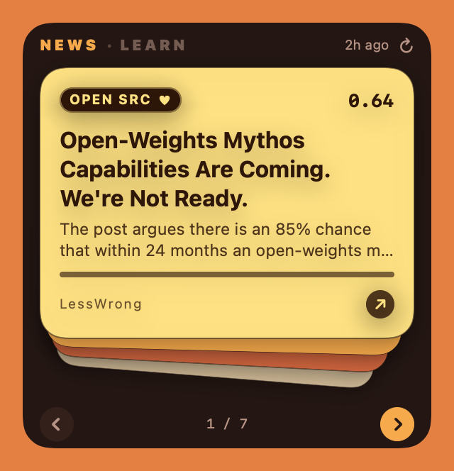
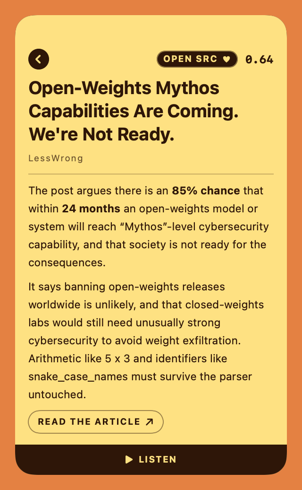
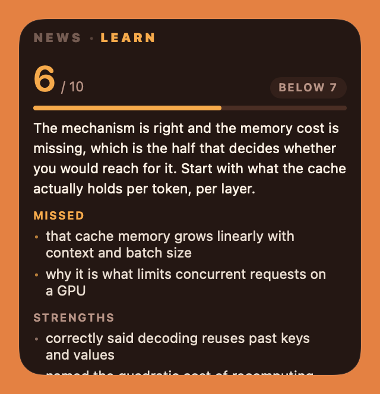

# Daily Desk

**A small window that sits on my Mac desktop, shows me the handful of news
stories actually worth reading today, and gives me fifteen minutes of study
that gets graded.**

<table>
  <tr>
    <td width="33%"></td>
    <td width="33%"></td>
    <td width="33%"></td>
  </tr>
  <tr>
    <td align="center"><em>Flip through the day</em></td>
    <td align="center"><em>Open one and read it</em></td>
    <td align="center"><em>Or get graded on what you know</em></td>
  </tr>
</table>

## What it is, in plain English

Most news apps show you everything and leave you to do the sorting. This one
does the sorting first.

Every morning at 8am, a program on my Mac reads about sixty news sites,
throws away everything I wouldn't care about, writes a short honest summary
of the ten stories that survive, and leaves them on my desktop as a small
stack of cards. I flip through them with an arrow button. If one looks
interesting I click it, and the card opens out into the full summary — or I
press **Listen** and it reads the story aloud.

That's the whole thing. No app to launch, no feed to scroll, no
notifications. It just sits on the desktop behind my windows, like a sticky
note that keeps itself up to date.

## How it decides what's worth reading

I wrote down what I'm interested in — thirteen subjects, in ordinary English
sentences. Things like *what's actually happening in the world today*,
*startups raising money in Europe*, or *what's on in Barcelona this weekend*.
That file is the whole configuration; there is no algorithm learning about me
in the background that I can't see or edit.

Every new article gets compared against those descriptions and scored from 0
to 1. The comparison is done by **meaning, not keywords** — an article about
"on-device inference" matches "AI running on small hardware" without either
phrase appearing in the other. Only the best ten make the cut, and each one
arrives with a note saying which subject it matched and how strongly, so when
something wrong shows up I can see why and fix the description.

Three deliberate rules keep it from getting boring:

- **No subject can take over the page.** Barcelona's newspapers publish far
  more than the engineering blogs do, so a straight top-ten would be local
  news every day. Any one subject is capped, and the empty slots get filled
  by the next best stories.
- **One story a day is chosen on purpose to be off-profile.** A system that
  only shows you things matching what you already like can never show you
  something new. So one card every day — marked **WILDCARD** — is picked at
  random from the middle of the pile: related to my interests, but not
  something the profile would ever have chosen.
- **It remembers what I actually liked.** A thumbs up or down on any story is
  kept and fed back into the scoring, so the written profile handles what I
  *say* I want and the record of my choices handles what I *actually* read.

Stories I've already been shown don't come back for 45 days.

## The other half: fifteen minutes of learning


The second tab is a study habit rather than a reader. It picks one of 78
machine-learning topics at random, starts a fifteen-minute timer, and then
asks me to explain that topic from memory in my own words. An AI grades the
explanation against a checklist of what a good answer contains — a checklist
I never get to see beforehand, because if I could read it the exercise would
be reading rather than recall. It comes back with a score, the specific
things I missed, and the things I got right. Streaks and a rolling average
are kept.

The countdown is the widget's own border, draining from the top as the
fifteen minutes run down, the way the iPhone's Dynamic Island does it. On a
window this small, a timer that costs no space is the difference between the
countdown being readable and being an afterthought.

## Where it started: a thing on my desk

This began as physical hardware — a small ESP32 microcontroller with a narrow
touch screen, sitting on the desk showing the same digest and reading stories
aloud through a speaker. That device is retired now, but the card deck, the
colour palette and the open-a-story animation were all designed for it first
and then brought over to the Mac. The backend still speaks the exact same
protocol the device used, so it could be plugged back in tomorrow.

That's also why half the code is still named `esp-` something. Renaming it now
would strand the copy of the app already installed on this machine, which is a
worse outcome than a name that's a bit historical.

## How it's built

```
58 news feeds
      │
      ▼
  fetch  →  remove duplicates  →  score against my interests
      │
      ▼
  pick the best 10  →  fetch each real article  →  write a summary
      │
      ▼
  a small web server on my Mac  ──►  the desktop widget
```

| Part | Built with |
|---|---|
| The pipeline that reads and ranks the news | Python, LangGraph |
| The server the widget talks to | FastAPI |
| The desktop widget itself | Swift and SwiftUI, no Xcode project — it builds with the command line tools alone |
| Ranking, summaries, grading, narration | OpenAI embeddings, a small reasoning model, text-to-speech |
| Storage | plain files for the digests, SQLite for the learning history |
| Scheduling | macOS launchd, every morning at 08:00 |

A few decisions worth knowing about, since they're the interesting part:

- **The summaries are written from the real article, not the feed blurb.**
  What RSS hands over is usually a teaser cut off mid-sentence, or in Hacker
  News's case just a score and a comment count. So the program fetches the
  actual page and summarizes that. If the fetch fails — paywall, blocked
  request — the original blurb stands rather than having an AI invent a
  summary from a headline. Every summary carries a marker saying which of
  those happened, so a source quietly breaking is visible instead of just
  slowly getting worse.
- **Summarizing happens last, not first.** Ranking uses the cheap feed text,
  because it only has to be good enough to sort. Summarizing ~500 articles
  and then discarding 490 of them would be the expensive way round.
- **Everything expensive is cached on disk.** Re-running while tuning the
  interest profile costs almost nothing — only genuinely new text hits the
  API. A full run is a fraction of a cent.
- **The widget is a front end and nothing more.** It knows about a URL and
  some JSON; it knows nothing about feeds, scoring or AI. That's why the same
  backend drove a microcontroller and a Mac app without changes.
- **214 tests**, covering the ranking, the caching, the feedback maths, the
  API contracts and the widget's layout.

Roughly 9,000 lines of Python and 5,500 of Swift.

## Running it

Needs [uv](https://docs.astral.sh/uv/) and an OpenAI API key.

```bash
uv sync
cp .env.example .env          # then add your key

uv run esp-digest             # build today's digest and print it
uv run esp-serve --port 8010  # serve it

cd desktop && make run        # build and launch the widget
```

## More detail

| Document | What's in it |
|---|---|
| [docs/pipeline.md](docs/pipeline.md) | the full engineering write-up of the backend — every phase, and why each decision went the way it did |
| [desktop/README.md](desktop/README.md) | the widget: the deck animation, the macOS window-level traps, the colour sampling |
| [docs/feedback-api.md](docs/feedback-api.md) | the thumbs up/down API, written for client authors |
| [interests.yaml](interests.yaml) | the interest profile itself — the file that decides what shows up |
| [topics.yaml](topics.yaml) | the 78 learning topics and their grading checklists |
