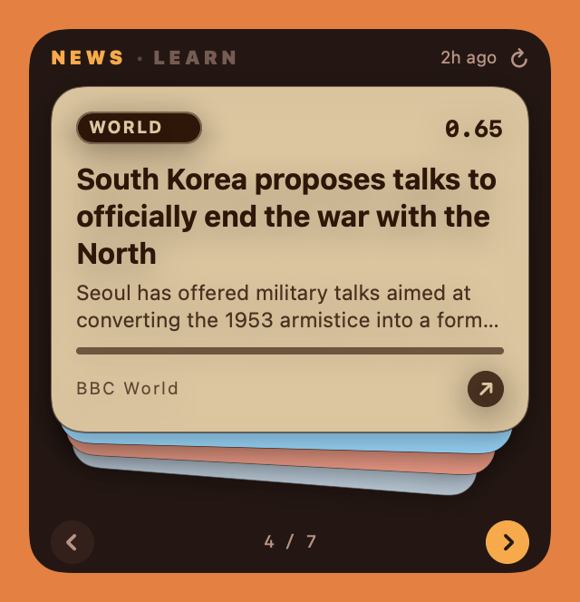
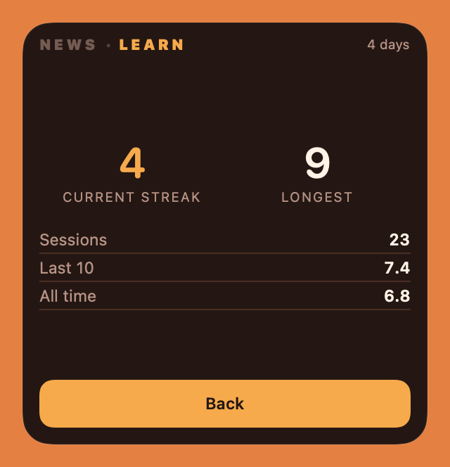

# Daily Desk

**A small window that sits on my Mac desktop, shows me the handful of news
stories actually worth reading today, and gives me fifteen minutes of study
that gets graded.**

<table>
  <tr>
    <td width="33%"></td>
    <td width="33%"></td>
    <td width="33%"></td>
  </tr>
  <tr>
    <td align="center"><sub><b>Flip through the day</b><br>ten stories, one card at a time</sub></td>
    <td align="center"><sub><b>Open one and read it</b><br>summary, or have it read aloud</sub></td>
    <td align="center"><sub><b>Get graded on what you know</b><br>fifteen minutes, then explain it</sub></td>
  </tr>
</table>

<sub>Real screenshots, rendered straight from the app by its own snapshot mode —
`swift run ESPNewsWidget --snapshot out/ --offline` — so they regenerate
instead of going stale.</sub>

## What it is, in plain English

Most news apps show you everything and leave you to do the sorting. This one
does the sorting first.

Every morning at 8am, a program on my Mac reads about sixty news sites,
throws away everything I wouldn't care about, writes a short honest summary
of the ten stories that survive, and leaves them on my desktop as a small
stack of cards. I flip through them with an arrow button. If one looks
interesting I click it, and the card opens out into the full summary — or I
press **Listen** and it reads the story aloud.

That's the whole thing. No app to launch, no feed to scroll, no
notifications. It just sits on the desktop behind my windows, like a sticky
note that keeps itself up to date.

## How it picks the ten

This is the part of the project I care most about, so it gets the most room.
Roughly 500 articles come in every morning and ten go on the desk. Here is
the whole of how that happens.

### The profile is a file I wrote, not a model that watched me

Thirteen subjects, each one a short paragraph of ordinary English plus a
handful of example headlines. *What's actually happening in the world today.
Startups raising money in Europe. What's on in Barcelona this weekend.*

That file **is** the algorithm's opinion of me. I can open it, disagree with
it, and change a line. Nothing is learned about me in the background that I
can't read, and there is no engagement signal anywhere in the system — it
doesn't know or care what I clicked on, only what I told it and what I
explicitly thumbed.

### Matching is by meaning, not by keywords

Every article and every line of the profile is turned into a point in space,
positioned so that things which *mean* similar things land near each other.
Scoring is just measuring how close two points are.

This is why an article about "on-device inference" matches a profile line
about "AI running on small hardware" — no word appears in both. A keyword
filter gets this wrong in both directions: it misses the article that says
the same thing in different words, and it happily matches an article that
uses your words to say something else entirely.

### An article only has to be good at one thing

All thirteen subjects score every article from 0 to 1. The article keeps its
**best** score, not its average. From this morning's run:

```
  "South Korea proposes talks to officially end war with North"   BBC World

     world_politics    0.65  ████████████████████
     startup_vc        0.17  █████
     tech_careers      0.15  █████
     model_architect…  0.12  ████
                             └── keeps 0.65, filed under WORLD
```



Averaged across all thirteen, this story scores 0.14 and never sees daylight.
Taking the best is how a front page actually works: nobody rejects a great
hardware post for having nothing to say about Barcelona.

On the right is that same story as it actually landed on the desk. The
badge is the subject that won it and the number is the score — the ranking
isn't hidden behind the design, it's printed on the card.

That's what makes the profile debuggable. When a story shows up that
shouldn't have, I can see which subject let it in and go fix that paragraph,
rather than guessing at a model.

### Each subject has a volume knob

One number per subject, because subjects don't score on the same scale.
Measured on the same morning's articles, before any knob is applied: a
Barcelona listicle matches its description almost word for word and reaches
**0.72**. The best world news story of the day reaches **0.48** — not because
it's a worse story, but because a wire headline is specific and unrepeatable
(*"South Korea proposes talks"*) and so sits further from any general
description, however well written.

Without correction the world section would simply never appear, not because
I don't want it but because of how its headlines are shaped. The knob fixes
that, and it's one number I can turn.

### What a thumbs-up actually does

The part people assume is magic, and isn't.

**A thumbs-up does not mean "more world news."** It means *"more articles
like this one."* The article's own text is kept and pinned to the subject it
matched, as a worked example of what good looks like there. From then on,
new articles are measured against my examples as well as against my
description. Everything I've liked within one subject blends into a single
composite example.

Two things keep that from taking over.

**It's throttled, hard.** A like can lift a story by at most 0.05, on a scale
where making the page takes about 0.6. A nudge — a few places up the ranking,
never a promotion from nowhere. That sounds too timid to be worth building
until you see it switched off: in testing, a single thumbs-up on one
Barcelona street-festival story pulled seven more festival stories onto the
front page, one of them from as deep as rank 97. One click, and tomorrow's
paper is all festivals. **That loop — like something, get more of it, like
that, get more of it — is the thing that makes every recommendation feed
converge on slop, and the cap is what stands in front of it.**

**It only touches one subject.** A like on a Spanish news story changes
nothing about how AI articles are ranked. A misfiled thumb costs one subject,
not the whole profile.

A thumbs-down works the same way in reverse and gets an even shorter lever,
for a reason worth knowing: a whole disliked article recognises its own kind
*very* precisely — about 0.94 similarity against its nearest neighbours,
roughly double what any hand-written phrase manages. It's the sharpest
instrument in the system, so it's given the smallest handle.

### Three rules that stop it eating itself

- **No subject can take the page.** Barcelona's papers publish far more than
  the engineering blogs, so a straight top ten would be local news daily. Any
  one subject is capped at three, and freed slots go to the next best stories.
- **One story a day is deliberately off-profile.** Marked **WILDCARD**, drawn
  at random from the middle of the pile — close enough to be relevant, never
  something the profile would have chosen. It is also completely blind to my
  likes and dislikes: it draws from the written-profile-only ranking, so the
  one slot meant to show me something new can't be captured by the feedback
  loop.
- **Nothing repeats for 45 days**, tracked by canonical URL so a link with
  tracking junk on the end still counts as the same story.

Put together: what I *say* I want is a file I can edit, what I *actually*
thumb nudges it within strict limits, and one slot every day belongs to
neither.

## The other half: fifteen minutes of learning

The second tab is a study habit rather than a reader.

<table>
  <tr>
    <td width="33%"></td>
    <td width="33%"></td>
    <td width="33%"></td>
  </tr>
  <tr>
    <td align="center"><sub><b>1. Draw a topic</b><br>one of 78, at random</sub></td>
    <td align="center"><sub><b>2. Fifteen minutes</b><br>then explain it from memory</sub></td>
    <td align="center"><sub><b>3. Keep the streak</b><br>graded, tracked, averaged</sub></td>
  </tr>
</table>

It picks one of 78 machine-learning topics at random, starts a fifteen-minute
timer, and then asks me to explain that topic from memory in my own words. An
AI grades the explanation against a checklist of what a good answer contains
— a checklist I never get to see beforehand, because if I could read it the
exercise would be reading rather than recall. It comes back with a score, the
specific things I missed, and the things I got right.

The reason it works this way: reading about something feels like learning and
mostly isn't. Explaining it without the page in front of you is the part that
tells you whether you actually know it.

**The countdown is the widget's own border** — look at the middle screenshot
— draining from the top as the fifteen minutes run down, the way the iPhone's
Dynamic Island does it. On a window this small, a timer that costs no
vertical space is the difference between the countdown being readable and
being an afterthought.

## Where it started: a thing on my desk

This began as physical hardware — a small ESP32 microcontroller with a narrow
touch screen, sitting on the desk showing the same digest and reading stories
aloud through a speaker. That device is retired now, but the card deck, the
colour palette and the open-a-story animation were all designed for it first
and then brought over to the Mac. The backend still speaks the exact same
protocol the device used, so it could be plugged back in tomorrow.

That's also why half the code is still named `esp-` something. Renaming it now
would strand the copy of the app already installed on this machine, which is a
worse outcome than a name that's a bit historical.

## How it's built

```
58 news feeds
      │
      ▼
  fetch  →  remove duplicates  →  score against my interests
      │
      ▼
  pick the best 10  →  fetch each real article  →  write a summary
      │
      ▼
  a small web server on my Mac  ──►  the desktop widget
```

| Part | Built with |
|---|---|
| The pipeline that reads and ranks the news | Python, LangGraph |
| The server the widget talks to | FastAPI |
| The desktop widget itself | Swift and SwiftUI, no Xcode project — it builds with the command line tools alone |
| Ranking, summaries, grading, narration | OpenAI embeddings, a small reasoning model, text-to-speech |
| Storage | plain files for the digests, SQLite for the learning history |
| Scheduling | macOS launchd, every morning at 08:00 |

A few decisions worth knowing about, since they're the interesting part:

- **The summaries are written from the real article, not the feed blurb.**
  What RSS hands over is usually a teaser cut off mid-sentence, or in Hacker
  News's case just a score and a comment count. So the program fetches the
  actual page and summarizes that. If the fetch fails — paywall, blocked
  request — the original blurb stands rather than having an AI invent a
  summary from a headline. Every summary carries a marker saying which of
  those happened, so a source quietly breaking is visible instead of just
  slowly getting worse.
- **Summarizing happens last, not first.** Ranking uses the cheap feed text,
  because it only has to be good enough to sort. Summarizing ~500 articles
  and then discarding 490 of them would be the expensive way round.
- **Everything expensive is cached on disk.** Re-running while tuning the
  interest profile costs almost nothing — only genuinely new text hits the
  API. A full run is a fraction of a cent.
- **The widget is a front end and nothing more.** It knows about a URL and
  some JSON; it knows nothing about feeds, scoring or AI. That's why the same
  backend drove a microcontroller and a Mac app without changes.
- **214 tests**, covering the ranking, the caching, the feedback maths, the
  API contracts and the widget's layout.

Roughly 9,000 lines of Python and 5,500 of Swift.

## Running it

Needs [uv](https://docs.astral.sh/uv/) and an OpenAI API key.

```bash
uv sync
cp .env.example .env          # then add your key

uv run esp-digest             # build today's digest and print it
uv run esp-serve --port 8010  # serve it

cd desktop && make run        # build and launch the widget
```

## More detail

| Document | What's in it |
|---|---|
| [docs/pipeline.md](docs/pipeline.md) | the full engineering write-up of the backend — every phase, and why each decision went the way it did |
| [desktop/README.md](desktop/README.md) | the widget: the deck animation, the macOS window-level traps, the colour sampling |
| [docs/feedback-api.md](docs/feedback-api.md) | the thumbs up/down API, written for client authors |
| [interests.yaml](interests.yaml) | the interest profile itself — the file that decides what shows up |
| [topics.yaml](topics.yaml) | the 78 learning topics and their grading checklists |
